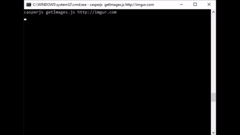
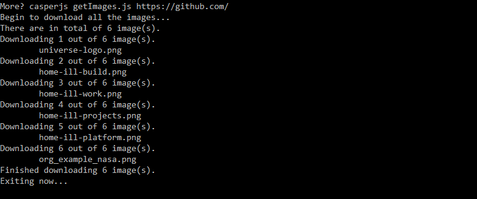

# image-downloader v1.0.5
Save and download all favorite images from website in an easy way.

## Why is this useful?

Right Click to save an image is no longer needed. You will be able to download/save all images from almost any website in an easy way.

## Installation

CasperJS can be installed on Mac OSX, Windows and most Linuxes. Please head over [here](http://docs.casperjs.org/en/latest/installation.html) to install CasperJS. The source code are provided in two format (zip and tar.gz), please download the [files](https://github.com/poanchen/image-downloader/releases) to your computer to start downloading images off from almost any site easily.

Run the following commands to get the getImages.js working,

```
git clone https://github.com/poanchen/image-downloader.git
cd image-downloader
npm install
```

## Environment

Tested on both Windows 10 and OS X 10.11 El Capitan.

## Usage

```
casperjs getImages.js http://www.example.com
```

Or, to enable debugging mode

```
casperjs getImages.js http://www.example.com --g
```

## Demo



